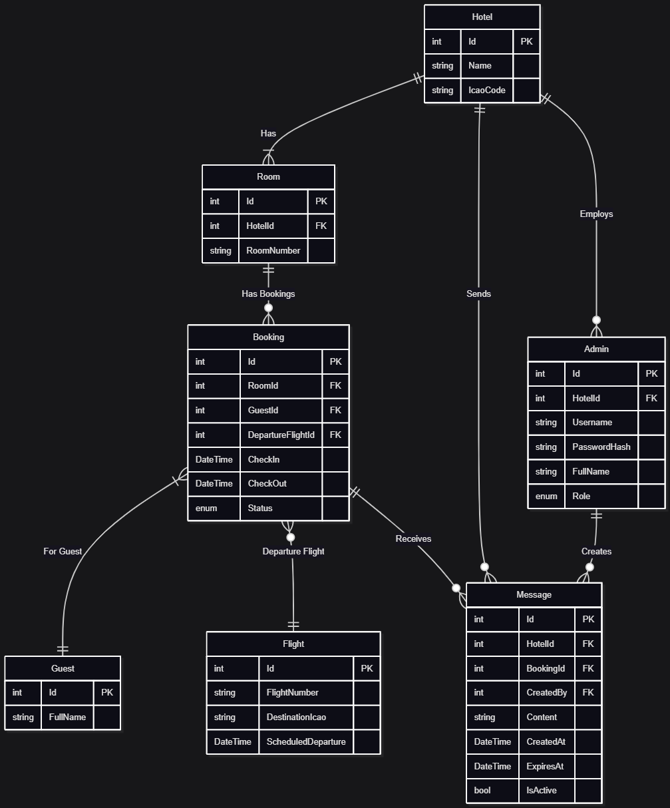

Spår B2B - Hotellversion Pilow
Hotellkedjan Pilows riktar sig till trötta piloter världen över och ska starta upp ett nytt koncept precis intill en flygplats. Det är helt upp till er vilken flygplats hotellet ska etablera sig på. Varje rum ska bestyckas med en smart spegel, ni kan anta att det är färre än 100 rum. Det är er uppgift att utveckla systemet för dessa speglar.

I hotellversionen krävs ingen personlig inloggning och vädret bestäms av hotellets position. Däremot kräver personalen en central kontrollstation som kan hantera gästernas speglar/dashboard. Från kontrollstationen ska personal kunna konfigurera rummens speglar efter gästens information. Som till exempel namn och pilotens nästa resmål.

Hotellspegeln innehåller:

Klocka
Lokalväder enl. hotellets ICAO kod
Destination
Väder på flygplatsen
Gate (om finns)
Avgångstid (om finns)
Flygplatsinformation
Arrivals
Departures + Boarding gates
Utöver innehåll ska hotellpersonalen kunna administrera sina enheter via en konsol eller applikation där de ska kunna:

Anpassa gästinformationen till varje rum/enhet
Namn
Nästa destination eller flygning
Skicka ut meddelanden och information som visas på gästernas enheter

DashyBoard features Hotellversion (B2B)

Klocka ✅
Lokaltrafik (t.ex. SL) ✅
Adminverktyg för att anpassa ✅
ICAO anpassat väder ✅
Flygplatsens boarding gates ✅
Flygplatsens arrivals ✅
Meddelandetjänst main -> sub ✅

# CiP-25-DashyBoard

System Architecture


Entity Relationship Diagram



1. Naming ConventionsWe will follow the industry standards for C#/.NET and TypeScript/React.


2. Git Workflow & Pull Requests (PRs)

   Skapa branch från Dev -> PR och Merge into Dev -> PR av Dev into Main


## 🐳 Docker Setup

### Starting the Application

Run all services (frontend and backend):

```bash
docker-compose up --build
```

### Accessing the Application

- **Frontend**: http://localhost:3000
- **Backend API**: http://localhost:5000
- **Swagger Documentation**: http://localhost:5000/swagger

### Services

1. **dashyboard-frontend** - React + Vite application served by Nginx
2. **dashyboard-api** - .NET 8 Web API with SQLite database

---

## 💾 Database

### SQLite Setup

The application uses **SQLite** for data storage. No separate database server is required - the database is a file stored in the `backend/data/` directory.

**Key Features:**

- ✅ Automatic schema creation on startup
- ✅ Data persists between container restarts via Docker volume
- ✅ File-based - portable and simple
- ✅ Perfect for development and small-to-medium applications

### Database Entities

The following entities are implemented:

| Entity      | Description                                                   |
| ----------- | ------------------------------------------------------------- |
| **Hotel**   | Hotel information with ICAO code for weather                  |
| **Room**    | Hotel rooms                                                   |
| **Guest**   | Guest information (pilots)                                    |
| **Admin**   | Hotel staff with roles and authentication                     |
| **Booking** | Room reservations with check-in/out dates and status          |
| **Flight**  | Flight information (number, destination, scheduled departure) |
| **Message** | Messages sent from admin to rooms or broadcast                |

**Database Location:**

- Inside container: `/app/data/DashyBoard_Dev.db`
- On host machine: `backend/data/DashyBoard_Dev.db`

### Viewing the Database

**Option 1: VS Code Extension (Recommended)**

1. Install "SQLite Viewer" extension in VS Code
2. Navigate to `backend/data/` folder
3. Click on `DashyBoard_Dev.db` file
4. View tables and data in the editor

**Option 2: DB Browser for SQLite**

- Download from: https://sqlitebrowser.org/
- Open `backend/data/DashyBoard_Dev.db`

**Option 3: Command Line**

```bash
sqlite3 backend/data/DashyBoard_Dev.db
.tables          # List all tables
SELECT * FROM Hotels;
```

### How Database Schema is Created

The application uses **Entity Framework Core's `EnsureCreated()`** method which automatically creates the database schema from entity classes on startup. No migrations needed for development.

---

## 🔧 Local Development

For local development without Docker:

**Backend:**

```bash
cd backend/DashyBoard.API
dotnet run
```

**Frontend:**

```bash
cd frontend
npm install
npm run dev
```

The frontend development server includes a proxy to the backend API at `/api/*`.

---

## 🚀 CI/CD Pipelines

### GitHub Actions Workflows

**1. Docker Build and Test** ([docker-build.yml](.github/workflows/docker-build.yml))

- Triggers on: Push/PR to `main` or `dev` branches
- Builds all Docker services
- Tests that frontend and backend start correctly
- Validates container health

**2. Docker Publish** ([docker-publish.yml](.github/workflows/docker-publish.yml))

- Triggers on: Push to `main` or `dev` branches
- Publishes Docker images to GitHub Container Registry
- Tags images with branch name and commit SHA
- Separate jobs for frontend and backend

---

## 📁 Project Structure

```
CiP-25-DashyBoard/
├── .github/workflows/         # CI/CD pipelines
├── backend/
│   ├── DashyBoard.API/        # Web API (Controllers, Middleware)
│   ├── DashyBoard.Application/# Business logic, DTOs, Features
│   ├── DashyBoard.Domain/     # Entities, Domain models
│   └── DashyBoard.Infrastructure/ # DbContext, Repositories, EF Core
├── frontend/
│   ├── src/                   # React components and pages
│   ├── Dockerfile             # Frontend Docker configuration
│   └── nginx.conf             # Nginx configuration for production
├── docker-compose.yml         # Multi-container orchestration
└── Dockerfile                 # Backend Docker configuration
```

---

## 📚 Tech Stack

**Backend:**

- .NET 8
- Entity Framework Core with SQLite
- Clean Architecture pattern
- Swagger/OpenAPI

**Frontend:**

- React 19
- TypeScript
- Vite
- React Router

**DevOps:**

- Docker & Docker Compose
- GitHub Actions
- Nginx (production frontend server)

---
